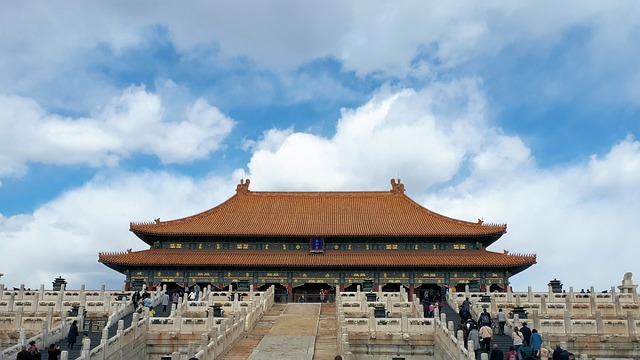
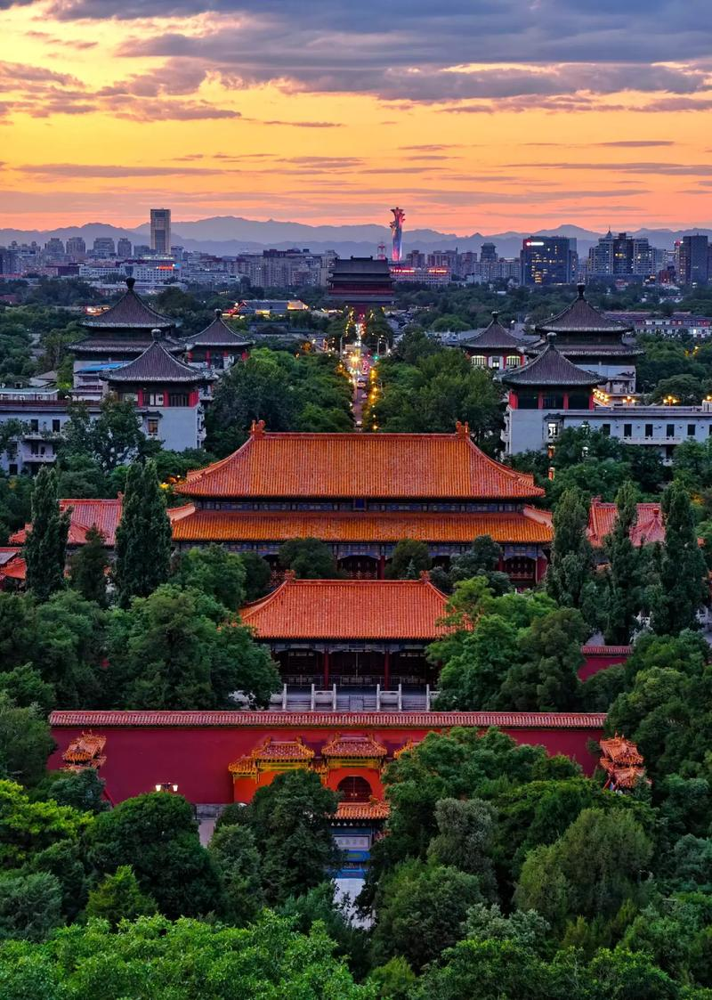

---

layout: post
title: "중국과 북경 그리고 중화권"
author: jjin
categories: [ china, bejing ]
image: assets/images/Cf1.png
featured: true
hidden: true

---

호하이 Photo from Baidu

######   스차하이(什剎海)의 호하이(后海, 後海) 그리고 후통은 북경 살때, 내가 바람 쐬러 한번씩 가던 곳이다. 그 인공 호수 겉을 걸어다니면 기분이 너무 좋았다. 저녁에는 저녁만의 운치가 있는 내가 북경의 정취를 느끼게 해주는 그런곳이었다.

---

자금성 Photo from Kwherzog

  중국이라는 곳은 나에게는 꽤나 특별한 곳이다. 20대에 꽤 되는 시간을 보내기도 했고 당시에는 전혀 상상조차 할 수 없는 길로 나를 이끌어 준 놀라운 곳이다.

  중국이 없었으면 현재의 나도 없었을 것이다. 지금의 가정도 직업도 모두 중국에서의 생활 떄문에 결론적으로 얻었기 때문이다. 물론, 현재의 내가 직접 밝히지 않으면 전혀 나와 중국의 연결은 알 수 없다.

  10여년 전의 북경은 너무나도 활기찬 도시였다. 최근에는 전혀 가보지를 않아서 어떤지 모르지만 멀리서나마 매체로 얻는 정보에 의하면 그리 좋지는 않으가보다. 당시에는 현 지도자가 막 집권해서 사람들의 기대가 꽤 큰상태였고, 거대한 회사들도 하나 둘씩 생겨나고 있었다. CCP에 대한 판단을 떠나서 꽤 많은 사람들에게는 기회의 땅이었다.

  당시 돈없던 유학생인 나는 가끔 북경의 종관춘(中关村, 中關村)에 돈을 찾으러 갔다. 거기에 City은행이 있었고 City은행에서는 한국계좌의 한화를 바로 위안화로 뽑아주는 서비스를 해줬다.(유학생들 사이에서는 가장 수수료가 저렴했던 걸로 기억한다.) 그러다 옆에 지나가면 보이는 차고카페(车库咖啡, 車庫咖啡)를 위시로 한 창업단지에서의 그 임팩트는 꽤나 대단했다. 그런 보습을 보면서 많은 사람들은 큰 꿈을 꾸지 않았을까 싶다. Jack ma(马云, 馬雲)의 등장과 알리바바(阿里巴巴)의 미 증시 상장 대성공 등 지금과는 꽤나 다른 분위기였었다. 요즘은 꽤나 우울한 기사들이 많다. 뭐 중국만 그렇겠나 전세계가 비슷하다.

경산공원 Photo from baidu tupian 

  기회 외에도 볼거리도 풍부하다. 만리장성(长城, 長城), 자금성(故宮), 이화원(颐和园, 頤和園), 천안문광장(天安门, 天安門), 왕푸징(王府井) 정도는 북경(北京)을 모르는 사람도 아닌 곳이고 그외에 경산공원(景山公园, 景山公園) 후통(胡同)거리 전문대로 천당공원(天坛公园, 天壇公園)? 북경탑(北京电视塔, 北京電視塔) 그리고 왕징(望京), 五道口 주변 대학로 그리고 아침에 눈비비고 일어나서 먹던 油条(油條), 饺子(餃子), 包子, 馄饨 음식들이 기억난다.

  다시 지난 20여년동안의 전세계의 안정적인 시대가 올까 싶기도 하다. 중국어와 담 쌓고 꽤나 오랜시간을 보냈다. 현재 하는 일이 그와 전혀 관련없는게 가장컸다. 중국생활시절에는 중국어로 뭐 좀 해볼까 싶었지만 그러지는 않았고 다만 중국에서의 경험이 세상을 새로이 바라로게 하였다.

  

  요즘 다시 중국어를 돌아본다. 중국뿐 아니라 중화권 매체들 전체적으로 보고 있다. 중국 본토외에, 싱가폴, 대만, 말레이시아 등등 한국에서만 살아서 잘 모르지만 중화권은 꽤나 크고 그안에서의 화교들은 모두다 성향이 매우 다르다. 어떤 사람들은 중국 본토에 대해서 굉장히 우호적이고 어떤 화교는 선을 긋기도 한다. 따라서 다양한 중화권의 매체 및 뉴미디어 매체들은 본토와는 다른 목소리도 많다.

 오늘은 정보 전달은 아니고 그냥 생각을 두서없이 막 쓸 글이다.
