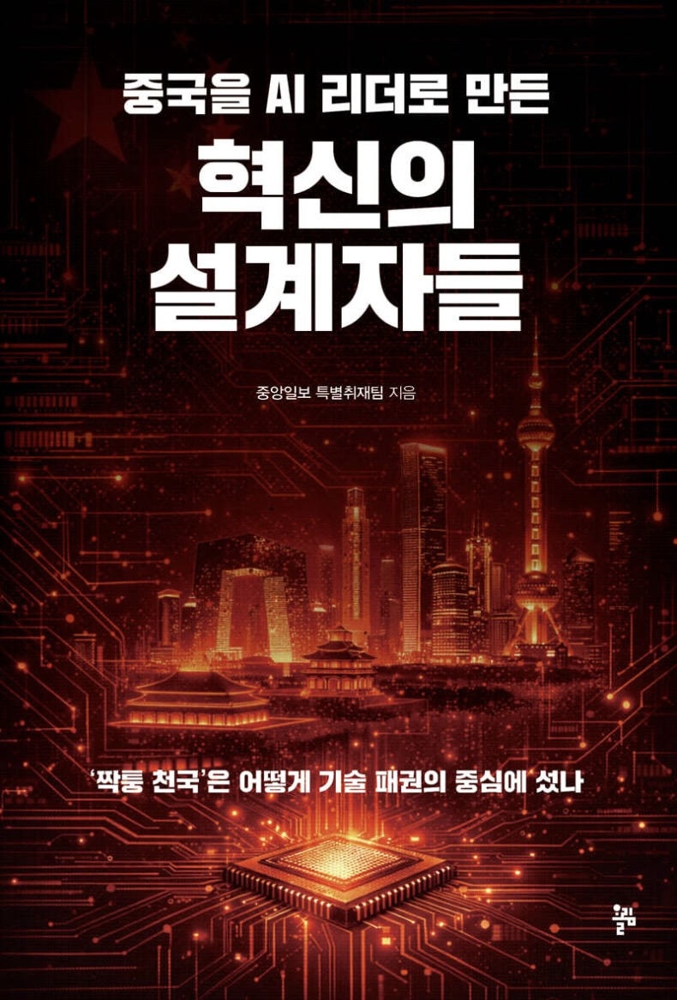

---

layout: post
title: "중국을 AI 리더로 만든 혁신의 설계자들(2)"
author: jjin
categories: [ China, AI, Book, "중국을 AI 리더로 만든 혁신의 설계자들" ]
image: assets/images/ai-china-title.jpg
featured: true
hidden: true

---

10분 책읽기 운동에 따른 짧은 독후감

중국은 미국의 반도체 공급제한 공격을 역으로 기회로 삼았다. 중국내에 있는 반도체 회사들은 미국의 공급망에서 제외된 그 시점에 우리가 미국의 공급망에 다시 돌아가는 것을 기대하기보단 차라리 우리가 만들겠다고 선언했다.

국가, 기업, 학계가 모두 하나되서 진행중이다. 캠브리콘이라는 회사는 ai반도체를 생산하고 있고 화웨이는 이것들 사용해서 모바일 칩을 만들어냈다. 그리고 그외에 자료들을 보면 바이두나 알리바바는 자체칩을 사용하려고 노력중이다.

국가에서는 대규모 인프라 클러스터를 제외하면 자국 생성 GPU를 쓸 것을 권고한다고 한다. 그래서 오히려 미국에서는 우려하는 중이라고 한다. 대부분의 사람들은 중국이 엔비디아 GPU를 갖지 못해서 아무것도 할 수 없을 것이라고 생각하는 것과 반대로, 젠슨황은 중국이 자체 칩을 생산하게 될 것을 더 우려한다고 한다.

현재 전세계 60% 점유율을 갖는 휴머노이드 회사도 중국에 있다. 그 이름은 유니트리 가성비가 엄청나다. 거기에 중국 정부에서 대놓고 밀어주고 있다. 성능이 나빴다면 중국정부가 밀어주지 않았을 것이라고 많은 사람들은 입모으고 있다. 

보면 볼수록 중국은 놀랍다.